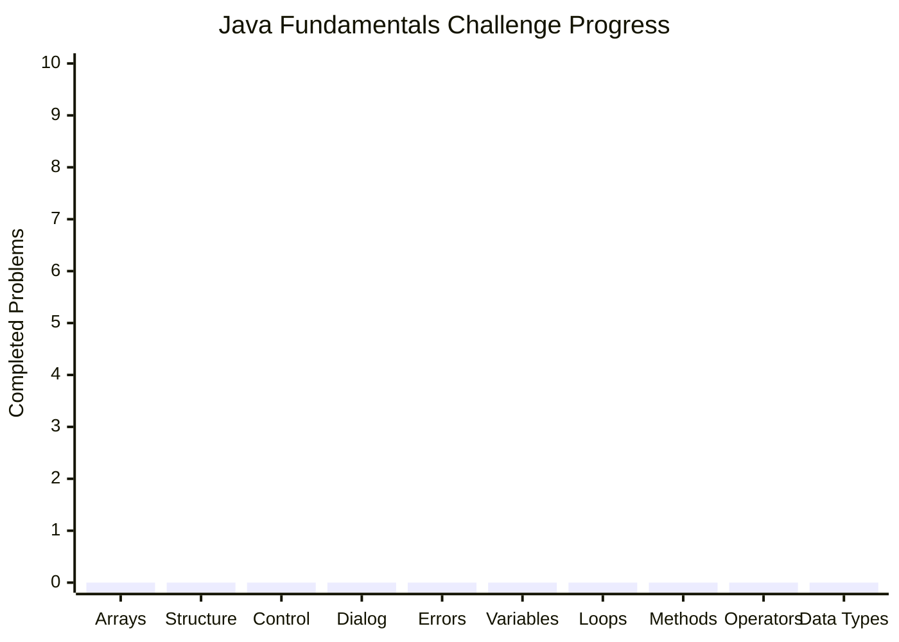

# 100-Java-Fundamentals-Drills
> 100 problems. 10 topics. 1 Java foundation.

A collection of **100 Java programming challenges and solutions** designed to strengthen fundamental programming skills through hands-on problem solving.
Each challenge of 100 Java prgoramming challenges and solutions designed to strenthen fundamental programming skils through hands-on problem solving.

---
## What's Inside?

📦 100-Java-Fundamentals-Drills  
│ 
├── 📁 javaArrays  
├── 📁 javaBasicStructure 
├── 📁 javaControlStatements 
├── 📁 javaDialogBox 
├── 📁 javaErrorHandling 
├── 📁 javaLocalAndGlobalVariables 
├── 📁 javaLoops 
├── 📁 javaMethods 
├── 📁 javaOperators 
└── 📁 javaVariablesAndDataTypes 

---
## Learning Objectives

By completing the 100 challenges in this repository, you will practice: 
- Java syntax and program structure 
- Variables and data types 
- User input and output 
- Arithmetic and logical operators 
- Conditional statements 
- Loops and nested loops 
- Arrays 
- Methods 
- Variable scope 
- Static and instance variables 
- JOptionPane dialog boxes 
- Exception handling 
- Basic problem-solving 
- Writing reusable Java code 

---
## Technologies Used

- Java 
- Java SE 21 
- Eclipse IDE 
- JOptionPane 
- Object-Oriented Programming concepts 

---
## Challenge Progress

| # | Package | Progress |
|:---:|:---|:---:|
| 01 | javaArrays | 0 / 10 |
| 02 | javaBasicStructure | 0 / 10 |
| 03 | javaControlStatements | 0 / 10 |
| 04 | javaDialogBox | 0 / 10 |
| 05 | javaErrorHandling | 0 / 10 |
| 06 | javaLocalAndGlobalVariables | 0 / 10 |
| 07 | javaLoops | 0 / 10 |
| 08 | javaMethods | 0 / 10 |
| 09 | javaOperators | 0 / 10 |
| 10 | javaVariablesAndDataTypes | 0 / 10 |
| TOTAL | 100 Challenges | 0 / 100 |
---
## Tracker

---
## Purpose

This repository serves as a personal Java fundamentals practice portfolio, documentaing my progress from basic Java syntax toward more structures problem-solving and programming concepts.  

Each challenge contains: 
Problem → Java Code → Solution  
The repository is intended for learning, practice, review and reference.

---
## Author

**Henry Jr Bue**  
BS Information Technology Student 
Java Programming Practice Repository 

---
If you find this repository useful, feel free to star it!

